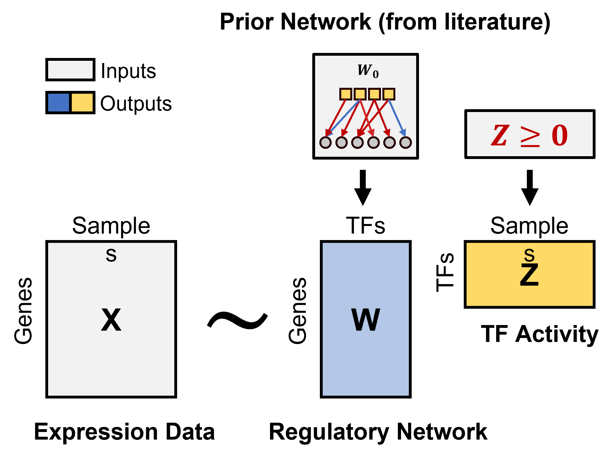

# TIGER

## Introduction

The goal of TIGER is to estimate gene regulatory network and
transcription factor activities using Bayesian matrix factorization.  
<!-- -->  
Please read and cite the following article when you use TIGER:  
[Joint inference of transcription factor activity and context-specific
regulatory networks, Chen&Padi
2022](https://www.biorxiv.org/content/10.1101/2022.12.12.520141v1)

## Installation

TIGER relies on [cmdstanr](https://mc-stan.org/cmdstanr/) for Beyesian
Inference. You can install the latest beta release of the cmdstanr R
package with

``` r
install.packages("cmdstanr", repos = c("https://mc-stan.org/r-packages/", getOption("repos")))
```

Then, you can use cmdstanr to install
[CmdStan](https://mc-stan.org/users/interfaces/cmdstan.html), the shell
interface to [Stan](https://mc-stan.org/) with

``` r
install_cmdstan()
```

These two steps are usually enough if your C++ toolchain is set up
properly. For example, use RTools 4.0 toolchain which contains a g++ 8
compiler and mingw32-make on Windows platform. If you see problems with
installation, you can go to cmdstanr
[installation](https://mc-stan.org/cmdstanr/articles/cmdstanr.html) for
more information.

After cmdstan is correctly installed, you can install the development
version of TIGER with:

``` r
devtools::install_github("cchen22/TIGER")
```

## Quick start

This is a simple example of TIGER on a small dataset. TIGER requires two
inputs -  
1. a normalized expression matrix with rows as genes and column as
samples;  
2. a prior network with rows as TFs and column as genes. The network is
signed and binarized (e.g., -1,0,1).

``` r
library(TIGER)

##1. load data
expr = TIGER::expr
prior = TIGER::prior

##2. run TIGER with default parameters
ss = TIGER(expr,prior)
```

    ## Estimating optimal shrinkage intensity lambda (correlation matrix): 0.6787 
    ## 
    ## ------------------------------------------------------------ 
    ## EXPERIMENTAL ALGORITHM: 
    ##   This procedure has not been thoroughly tested and may be unstable 
    ##   or buggy. The interface is subject to change. 
    ## ------------------------------------------------------------ 
    ## Gradient evaluation took 0.008 seconds 
    ## 1000 transitions using 10 leapfrog steps per transition would take 80 seconds. 
    ## Adjust your expectations accordingly! 
    ## Begin eta adaptation. 
    ## Iteration:   1 / 250 [  0%]  (Adaptation) 
    ## Iteration:  50 / 250 [ 20%]  (Adaptation) 
    ## Iteration: 100 / 250 [ 40%]  (Adaptation) 
    ## Iteration: 150 / 250 [ 60%]  (Adaptation) 
    ## Iteration: 200 / 250 [ 80%]  (Adaptation) 
    ## Iteration: 250 / 250 [100%]  (Adaptation) 
    ## Success! Found best value [eta = 0.1]. 
    ## Begin stochastic gradient ascent. 
    ##   iter             ELBO   delta_ELBO_mean   delta_ELBO_med   notes  
    ##    100     -1171074.398             1.000            1.000 
    ##    200      -157823.051             3.710            6.420 
    ##    300       -75833.770             2.834            1.081 
    ##    400       -58183.111             2.201            1.081 
    ##    500       -53081.533             1.780            1.000 
    ##    600       -51050.359             1.490            1.000 
    ##    700       -49850.082             1.281            0.303 
    ##    800       -49097.595             1.123            0.303 
    ##    900       -48638.556             0.999            0.096 
    ##   1000       -48219.092             0.900            0.096 
    ##   1100       -47906.769             0.819            0.040   MAY BE DIVERGING... INSPECT ELBO 
    ##   1200       -47734.081             0.751            0.040   MAY BE DIVERGING... INSPECT ELBO 
    ##   1300       -47557.680             0.693            0.024   MAY BE DIVERGING... INSPECT ELBO 
    ##   1400       -47412.426             0.644            0.024   MAY BE DIVERGING... INSPECT ELBO 
    ##   1500       -47351.151             0.601            0.015   MAY BE DIVERGING... INSPECT ELBO 
    ##   1600       -47269.802             0.564            0.015   MAY BE DIVERGING... INSPECT ELBO 
    ##   1700       -47192.708             0.531            0.009   MAY BE DIVERGING... INSPECT ELBO 
    ##   1800       -47166.698             0.501            0.009   MAY BE DIVERGING... INSPECT ELBO 
    ##   1900       -47082.350             0.475            0.009 
    ##   2000       -47084.804             0.451            0.009 
    ##   2100       -47043.676             0.430            0.007 
    ##   2200       -47003.345             0.410            0.007 
    ##   2300       -46991.764             0.392            0.004   MEDIAN ELBO CONVERGED 
    ## Drawing a sample of size 300 from the approximate posterior...  
    ## COMPLETED. 
    ## Finished in  75.3 seconds.

``` r
##3. print the TFA score in first three samples
tgres = ss$Z
tgres[,1:3]
```

    ##       GSM782710_CEBPD GSM782711_CEBPZ GSM782714_ETS1
    ## CEBPD      0.16995715      0.06962729     0.07757839
    ## CEBPZ      0.04584281      0.01014883     0.10245526
    ## ETS1       0.10160440      0.09648879     0.02618637
    ## FOXM1      0.53454111      0.15332452     0.19762255
    ## FOXO3      0.18207905      0.16695081     0.17561871
    ## HSF2       0.08228031      0.03063709     0.13700934
    ## MITF       0.15515221      0.13553729     0.12691376
    ## RELA       0.10513991      0.08928370     0.03607522
    ## SP1        0.04577883      0.03665489     0.09852019
    ## SP100      0.04896814      0.06436493     0.04137325
    ## STAT1      0.04235073      0.04073346     0.05757398
    ## STAT3      0.09059502      0.08443980     0.04378273
    ## STAT6      0.13057221      0.17615136     0.09388253
    ## TP53       0.04618498      0.04375639     0.07959729

## Wokring with DoRothEA prior

TIGER provides some convenient functions to work with DoRothEA prior
database. Firstly, install DoRothEA R package from
[Bioconductor](https://bioconductor.org/packages/release/data/experiment/html/dorothea.html)

``` r
BiocManager::install("dorothea")
```

DoRothEA provides regulons for two species - human and mouse. For
example,if we have a human cancer expression matrix and want to estimate
the TFA in each cancer sample, then we can use the following code to
prepare the prior network.

``` r
## load dorothea pancancer database
df = dorothea::dorothea_hs_pancancer

## convert it to TIGER prior format (e.g., adjacency matrix) 
prior = el2adj(df[,-2])
```
