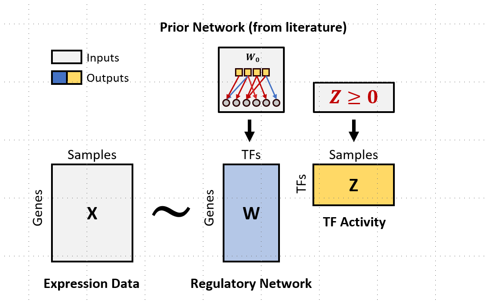

<!-- README.md is generated from README.Rmd. Please edit that file -->

# TIGER

<!-- badges: start -->
<!-- badges: end -->

## Introduction

The goal of TIGER is to estimate gene regulatory network and
transcription factor activities using Bayesian matrix factorization.  
<!-- -->  
Please read and cite the following article when you use TIGER:

## Installation

TIGER relies on [cmdstanr](https://mc-stan.org/cmdstanr/) for Beyesian
Inference. You can install the latest beta release of the cmdstanr R
package with

``` r
install.packages("cmdstanr", repos = c("https://mc-stan.org/r-packages/", getOption("repos")))
```

Then, you can use cmdstanr to install
[CmdStan](https://mc-stan.org/users/interfaces/cmdstan.html), the shell
interface to [Stan](https://mc-stan.org/) with

``` r
install_cmdstan()
```

These two steps are usually enough is your C++ toolchain is set up
properly. For example, use RTools 4.0 toolchain which contains a g++ 8
compiler and mingw32-make on Windows platform. If you see problems with
installation, you can go to cmdstanr
[installation](https://mc-stan.org/cmdstanr/articles/cmdstanr.html) for
more information.

After cmdstan is correctly installed, you can install the development
version of TIGER from [GitHub](https://github.com/) with:

``` r
devtools::install_github("cchen22/TIGER")
```

## Quick start

This is a simple example of TIGER on a toy dataset. For more
applications, please see our
[vignettes](https://github.com/cchen22/TIGER/tree/master/vignettes).

``` r
library(TIGER)
## basic example code
```
